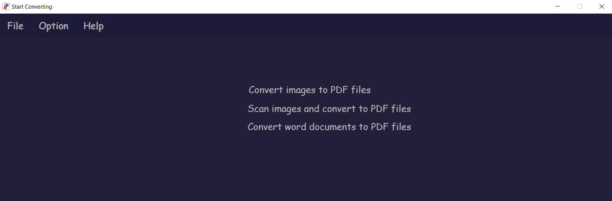
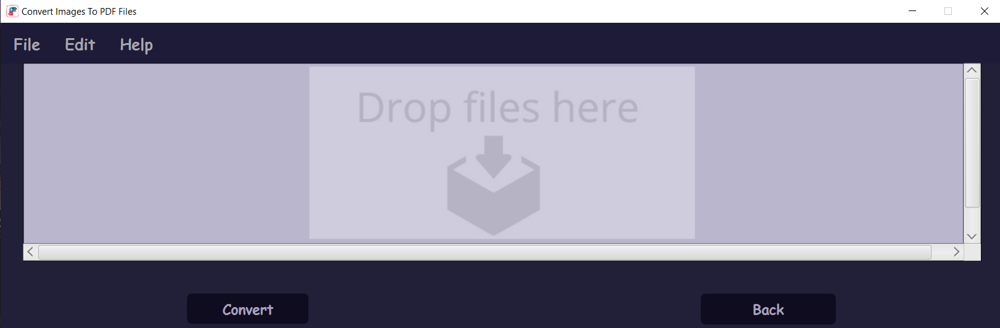
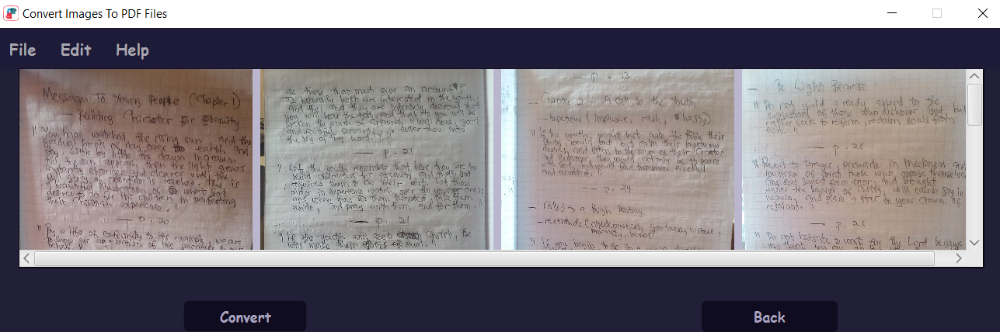

# Images-Docx-To-PDF-Converter

## Images Docx Files to PDF Converter

ImagesDocxToPDFConverter is a JavaFX desktop application that allows users to convert either images (.jpg or .png) files or .docx files to PDF files by dragging and dropping the files for conversion.

---
## Input files

The program takes the following as input files:

 * [__Image files__](https://github.com/tafadzwabmotsi/Images-Docx-To-PDF-Converter/tree/master/input_images "image input files")
 * [__Word document files__](https://github.com/tafadzwabmotsi/Images-Docx-To-PDF-Converter/tree/master/word_input_images "word input files")
 
 ---
 ## Processing
 The application uses __itextpdf__ and __documents4j__ packages to convert images and docx files to Acrobat PDF format respectively. 
 
 ### Processing image files
 Given an image, the program does the following:
  * Creates a new Document instance and FileOutputStream instance
  * Instantiates a new PdfWriter object
  * Opens the PdfWriter and Document
  * Creates a new page where the image will be rendered
  * Instantiates and gets a new Image object
  * Sets image's absolute position __(x, y) = (0, 0)__, border width to __0__, and the image's page size to __A4__
  * Adds the image to the Document object which will convert the image file
  * Close Document and PDFWriter
 
 ### Process word files
  * Instantiates two  File objects for input and output files respectively.
  * Instantiates an InputStream and and OutputStream object for input and output files respectively
  * Builds an IConverter to convert the input file to its respective PDF file
  * Converts the word file to PDF file
  * Shuts IConverter
  * Close the Inputstream and Outputstream objects

## User Interface

The application has three options (shown in the screen shot below) for the user:

---

## Converting Images to PDF

### Drag and Drop Images

Clicking on the first option, the program launches a new scene prompting the user to drag the image files to the window area:

### Converting

On dropping the images, the preview window is launched and the user can browse through the images to converted by scrolling on the window (see the screen shot below):

---
## Results
  * [Output files](https://github.com/tafadzwabmotsi/Images-Docx-To-PDF-Converter/tree/master/output_files "Converted PDF files")

---
## Technologies
 * [Java](https://docs.oracle.com/en/java/ "Java")
 * [JavaFX](https://openjfx.io/ "JavaFx")
 * [itextpdf](https://itextpdf.com/en/resources/api-documentation "itextpdf package")
 * [documents4j](https://documents4j.com/ "documents4j package")
